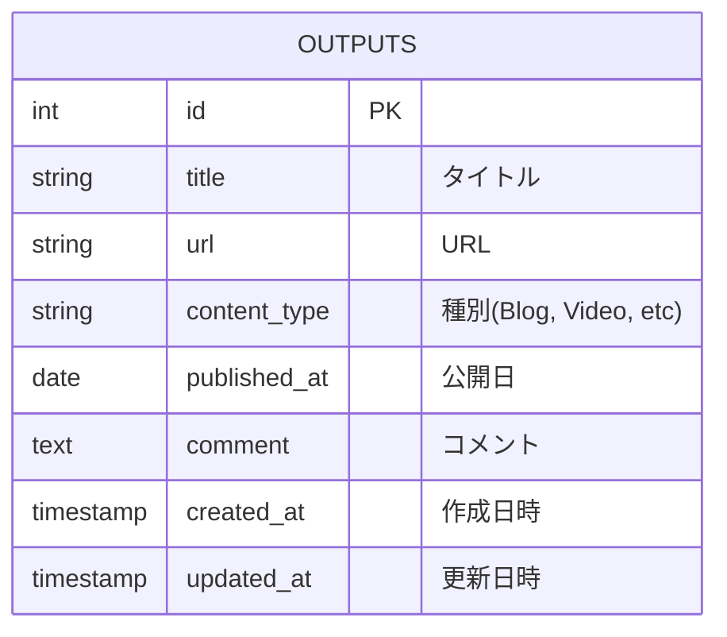

# データベース設計書 (Database Schema)

## 概要
本プロジェクト「どんなことでもアウトプットこそ重要！」のデータ永続化層の定義。
PostgreSQLを使用し、成果物（Outputs）の管理を行う。

## ER図 (概念)

## テーブル定義

### 1. outputs
成果物を格納するメインテーブル。

| カラム名 | データ型 | 制約 | 説明 |
| :--- | :--- | :--- | :--- |
| **id** | SERIAL | PK | 一意な識別子 |
| **title** | VARCHAR(255) | NOT NULL | 成果物のタイトル |
| **url** | TEXT | NOT NULL | 成果物のURL |
| **content_type** | VARCHAR(50) | NOT NULL | 成果物の種類 (Blog, Video, Other) |
| **published_at** | DATE | NOT NULL | 成果物の公開日/実施日 |
| **comment** | TEXT | | 任意のコメント |
| **created_at** | TIMESTAMP | DEFAULT NOW() | レコード作成日時 |
| **updated_at** | TIMESTAMP | DEFAULT NOW() | レコード更新日時 |

## インデックス
* `idx_outputs_published_at`: `published_at` (DESC) - 一覧表示のソート用
